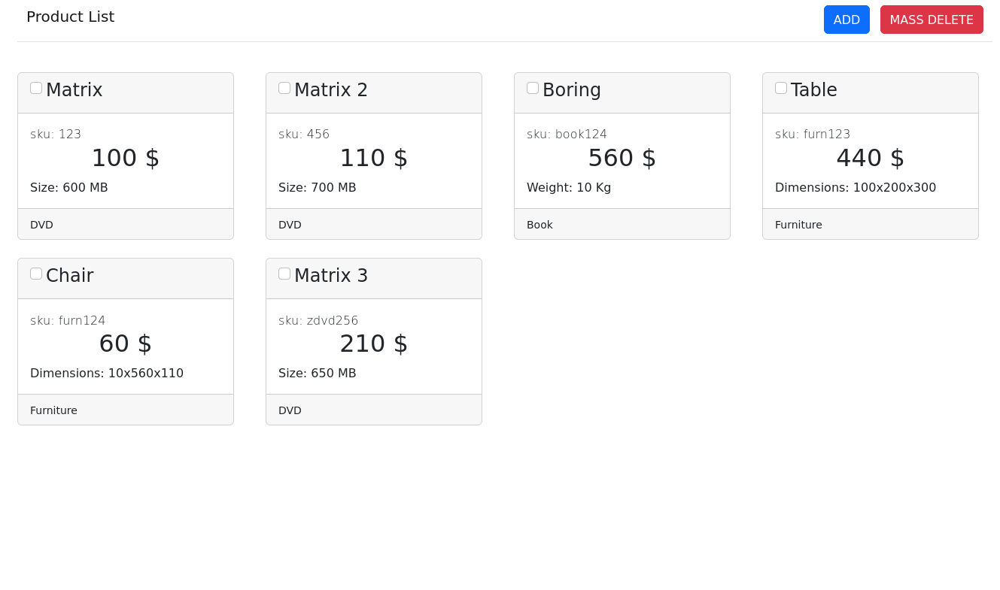
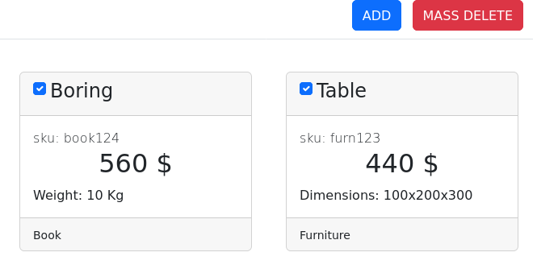
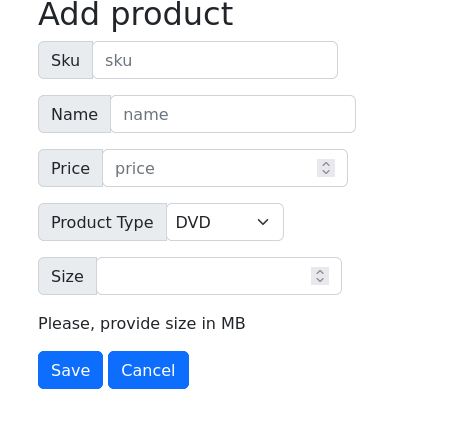
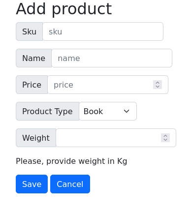
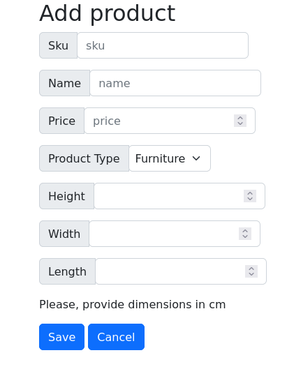
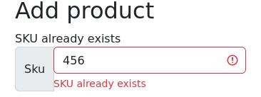
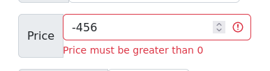

# Product list

[Test instance](https://sjdtt.mikusr.info/)

Application for listing products



## Requirements

- PHP 7.4
- MySQL (tested on 8.0.35)

## Install

clone repository

```bash
$ git clone https://github.com/MikusR/product-list.git
```

use Composer to get dependencies

```bash
$ composer install
```

copy .env.example to .env
and configure access to database
for example:

```ini
DBNAME = "swjd"
DBUSER = "root"
PASSWORD = "root"
HOST = "127.0.0.1"
PORT = 3377
DRIVER = "pdo_mysql"
```

create database

```bash
mysql> CREATE DATABASE swjd;
```

run migration (creates table and adds sample data)

```bash
php ./Migrate.php
```

or using apache (example apacheconf)

```apacheconf
<VirtualHost *:80>
     ServerAdmin admin@site1.your_domain
     ServerName sjdtt.mikusr.info
     DocumentRoot /var/ww/sjdtt.mikusr.info/public

     <Directory /var/ww/sjdtt.mikusr.info/public>
        Options Indexes FollowSymLinks MultiViews
        AllowOverride All
        Require all granted
     </Directory>

     ErrorLog ${APACHE_LOG_DIR}/sjdtt.mikusr.info_error.log
     CustomLog ${APACHE_LOG_DIR}/sjdtt.mikusr.info_access.log combined
</VirtualHost>
```

on first visit it is necessary to visit yourserver/migrate to create table and add sample data

```
localhost:9876/migrate
```

## Functionality

### Delete

Delete multiple products



### Add new product

#### Each product type has different attributes

You can add DVD



You can add Book



You can add Furniture



#### There are validation checks

If a sku already exists



Negative price entered

